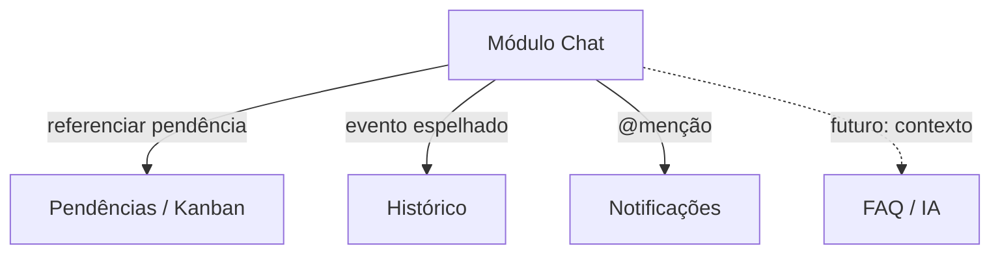

# Chat e colaboração

## Visão geral

Módulo **futuro** de **chat** para interação entre usuários do sistema. Qualquer usuário autenticado poderá conversar com qualquer outro usuário (1:1). O chat deve integrar-se com pendências, histórico e notificações.

**Estado no código:** chat **não implementado**. Infraestrutura de e-mail (`src/server/email/sendgrid.ts`) e sessão NextAuth existem parcialmente.

---

## Regras de negócio conhecidas

### RN-CH01 — Conversas 1:1
Qualquer usuário pode iniciar chat com qualquer outro usuário autenticado.

### RN-CH02 — Referência a pendências
Usuários devem poder **referenciar pendências** nas mensagens (detalhes de UX pendentes — ver perguntas em aberto).

### RN-CH03 — Grupos
Suporte a **grupos** de chat planejado (critérios de criação a definir).

### RN-CH04 — Histórico da pendência
Mensagens que referenciem uma pendência podem espelhar evento no histórico da pendência — ver [activity-history.md](./activity-history.md).

### RN-CH05 — Papéis
Permissões de chat são **iguais para todos os papéis** na v1, salvo moderação futura.

---

## Integrações planejadas

| Integração | Descrição |
|------------|-----------|
| Pendência | Link ou preview da pendência na mensagem; abrir modal a partir do chat |
| Histórico | Registrar menção ou discussão relevante na timeline da pendência |
| Calendário | (futuro) Referenciar meta com data |
| FAQ / IA | (futuro) Encaminhar trecho de conversa para base de conhecimento |

---

## Requisitos funcionais (planejados)

### RF-CH01 — Lista de conversas
Usuário vê conversas recentes ordenadas por última mensagem.

### RF-CH02 — Envio de mensagem
Texto em tempo real ou near-real-time (WebSocket ou polling).

### RF-CH03 — Referência `#pendencia`
Sintaxe ou picker para anexar referência a pendência por id/título.

### RF-CH04 — Grupos
Criar grupo, adicionar membros, nome do grupo (regras a definir).

### RF-CH05 — Menções
`@usuario` dispara notificação ao destinatário.

### RF-CH06 — Anexos
Política de anexos a definir (ver perguntas).

### RF-CH07 — Busca
Buscar mensagens por texto ou por pendência referenciada.

---

## Requisitos não funcionais

### RNF-CH01 — Privacidade
Mensagens 1:1 visíveis apenas aos participantes (e admin de sistema, se política exigir).

### RNF-CH02 — Retenção
Definir se conversas são permanentes ou arquiváveis.

### RNF-CH03 — Escalabilidade
Projetar para equipes de dezenas de usuários simultâneos (não chat público massivo).

---

## Lacunas no código

| Item | Status |
|------|--------|
| Modelo `Conversation`, `Message` | Não existe |
| Rota `/chat` | Não existe |
| Real-time transport | Não existe |
| UI de chat | Não existe |

---

## Perguntas em aberto — Chat e integrações

Respostas devem ser adicionadas nesta seção:

11. Referência a pendência no chat: **link clicável** que abre o modal, ou **preview inline** (card resumido)?
12. **Grupos de chat:** criados livremente, ou apenas por projeto / área / equipe?
13. Mensagens do chat entram automaticamente no **histórico da pendência** referenciada?
14. Chatbot IA responde **dentro do chat** ou em tela separada (ex.: Aprendizado)?
15. Conversas podem ser **arquivadas** ou são permanentes?
16. Chat suporta **anexos** com as mesmas regras de imagem das pendências?
17. Integração com **e-mail ou push** quando alguém é mencionado (`@user`)?
18. Moderação: coordenador pode ver conversas entre designers?
19. Mensagens editáveis ou apagáveis? Por quanto tempo?
20. Limite de tamanho de mensagem e rate limit anti-spam?

### Perguntas relacionadas (fluxo geral — ver também [pendencies-kanban.md](./pendencies-kanban.md))

2. Coordenador recebe **notificação** ao receber nova pendência (canal: chat, e-mail, in-app)?
3. Comentários do coordenador na pendência vs mensagens no chat — mesmo canal ou separados?
