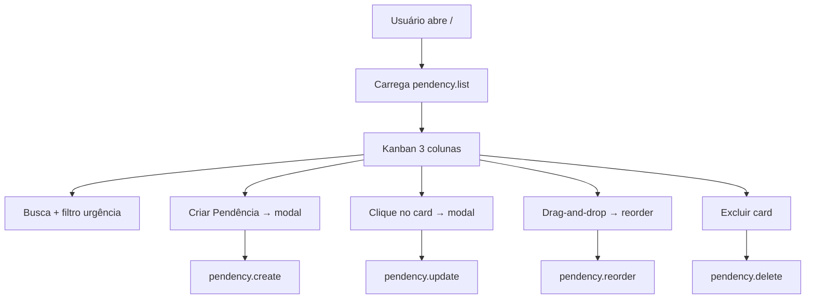

# Tela inicial — Pendências (Kanban)

## Visão geral

A **tela inicial** do sistema é a rota `/` (menu lateral: **Pendências**). Ela exibe um board estilo Kanban para gestão de **pendências** de conteúdo educacional, organizadas por status em colunas. É o núcleo operacional do produto: designers registram demandas; coordenadores analisam e acompanham; subcoordenadores executam tarefas operacionais.

**Grande área atual (fixa na UI):** Clínica Médica (`DEFAULT_AREA_TITLE`).

---

## Estado implementado

### Rota e composição

| Item | Detalhe |
|------|---------|
| Rota | `/` |
| Página | `src/app/(app)/page.tsx` — prefetch `pendency.list` + `PendencyBoard` |
| Layout | `src/app/(app)/layout.tsx` — sidebar + área principal |
| Componente principal | `src/app/(app)/_components/pendencies/pendency-board.tsx` |

### Layout da tela

```
┌─────────────────────────────────────────────────────────────┐
│  Sidebar (Pendências | Explorar | Aprendizado)              │
├─────────────────────────────────────────────────────────────┤
│  Cabeçalho: Grande área + título + busca + filtros urgência │
│            + botão "Criar Pendência"                         │
├─────────────────────────────────────────────────────────────┤
│  ┌──────────────┐ ┌──────────────┐ ┌──────────────┐         │
│  │   Pendente   │ │  Em revisão  │ │   Corrigido  │         │
│  │   (cards)    │ │   (cards)    │ │   (cards)    │         │
│  └──────────────┘ └──────────────┘ └──────────────┘         │
└─────────────────────────────────────────────────────────────┘
```

### Colunas e status (código atual)

| Chave (`PendencyStatus`) | Label na UI |
|--------------------------|-------------|
| `pending` | Pendente |
| `in_review` | Em revisão |
| `fixed` | Corrigido |

Definição: `src/shared/pendency.ts` — constantes `PENDENCY_STATUSES`, `PENDENCY_STATUS_LABELS`.

### Campos da pendência (implementados)

| Campo | Tipo | Observação |
|-------|------|------------|
| `id` | UUID | Gerado no create |
| `areaKey` | string | Padrão `default`; suporte multi-área no modelo |
| `title` | string | 1–500 caracteres |
| `descriptionMarkdown` | string | Até 50.000 caracteres; editor/preview no modal |
| `description` | string? | Legado; excerpt da primeira linha para o card |
| `projectKey` | enum | `extensivo_27`, `internato`, `usa_fichas` |
| `urgency` | enum | `low`, `medium`, `high` (Baixa, Média, Alta) |
| `status` | enum | Ver colunas acima |
| `position` | number | Ordem dentro da coluna |
| `attachments` | array | Imagens; upload Cloudinary no save |
| `links` | array | Até 20 URLs com label opcional |
| `checklist` | array | Até 50 itens; texto + checked |
| `createdAt` / `updatedAt` | ISO datetime | Mongoose timestamps |

**Não implementados ainda:** data início, data limite, responsável mais próximo, comentários, vínculo com meta do calendário, `createdBy` / `assignedTo`.

### Ações disponíveis na UI

| Ação | Como | API |
|------|------|-----|
| Listar | Carregamento do board | `pendency.list` |
| Criar | Botão "Criar Pendência" → modal | `pendency.create` (status sempre `pending`) |
| Editar | Clique no card → modal | `pendency.update` |
| Excluir | Botão no hover do card + confirmação | `pendency.delete` |
| Mover / reordenar | Drag-and-drop entre colunas e dentro da coluna | `pendency.reorder` |
| Filtrar | Busca por título + chips de urgência | Apenas client-side |

### Modal de detalhe (`PendencyDetailModal`)

Componentes em `src/app/(app)/_components/pendencies/modal/`:

- Título
- Descrição (Markdown)
- Tags: projeto + urgência
- Anexos (imagens, máx. 8, 5 MB cada)
- Links
- Checklist

**Status não é editável no modal** — apenas via drag-and-drop no board.

### Validações (servidor — Zod)

| Regra | Limite |
|-------|--------|
| Título | 1–500 chars |
| Descrição Markdown | máx. 50.000 |
| Links | máx. 20 |
| Checklist | máx. 50 itens; texto 1–500 |
| Anexos | máx. 8; somente `image/*`; pendente máx. 5 MB |

### Persistência e API

- **Banco:** MongoDB via Mongoose (`src/server/db/models/pendency.ts`)
- **Router:** `src/server/api/routers/pendency.ts`
- **Procedures:** `list`, `create`, `update`, `delete`, `reorder`
- **Autenticação:** todas usam `publicProcedure` — **sem verificação de usuário ou papel**

### Fluxo técnico atual



### Atualizações otimistas

O board usa cache otimista do React Query/tRPC para create, update e delete. Reorder invalida em caso de erro.

### Texto desatualizado na UI

O cabeçalho (`pendency-board-header.tsx`) ainda exibe:

> *"Protótipo visual — … Alterações não persistem ao atualizar a página."*

Isso **não é mais verdade** — os dados persistem em MongoDB. Deve ser corrigido na próxima passagem de UI.

---

## Regras de negócio alvo

### Propósito da tela por papel

| Papel | Foco na tela inicial |
|-------|----------------------|
| Designer 1 | Criar pendências, definir datas, prioridade, checklist; concluir ou cancelar |
| Designer | Criar e executar pendências; marcar concluído; preencher contexto |
| Coordenador | Analisar fila; comentar e editar descrição; ajustar prioridade; cancelar |
| Subcoordenador | Checklist e progresso operacional (Em análise / Corrigido); sem prioridade nem metas |

### Status alvo (5 colunas)

Substituir/evoluir o modelo atual de 3 status:

| Status | Chave sugerida | Label | Quem pode definir |
|--------|----------------|-------|-------------------|
| Pendente | `pending` | Pendente | Designer 1, Designer, Coordenador |
| Em análise | `in_analysis` | Em análise | Designer 1, Designer, Coordenador, Subcoordenador |
| Corrigido | `fixed` | Corrigido | Designer 1, Designer, Coordenador, Subcoordenador |
| Concluído | `completed` | Concluído | Designer 1, Designer |
| Cancelado | `cancelled` | Cancelado | Designer 1, Coordenador |

**Migração:** `in_review` (Em revisão) → `in_analysis` (Em análise).

### Campos alvo adicionais

| Campo | Quem pode definir/editar |
|-------|--------------------------|
| Data início | Designer 1, Coordenador |
| Data limite | Designer 1, Coordenador |
| Responsável mais próximo | Designer 1, Designer, Coordenador |
| Comentários (thread) | Conforme permissões de edição + histórico |

### Regras gerais do fluxo

1. **Designers** (tipos 1 e 2) criam pendências direcionadas à análise dos **coordenadores**.
2. **Coordenadores** analisam pendências e podem atualizar descrição, comentários e certos status — **não** marcam Concluído (apenas Designers 1 e 2).
3. **Coordenadores autorizados** (subtipo do papel 3) podem registrar pendências/metas no **calendário** com data início e data limite — ver [calendar-goals.md](./calendar-goals.md).
4. **Designer 1**, **Designer** e **Coordenador autorizado** podem editar e excluir pendências (regra de negócio original #9).
5. Todo passo relevante gera entrada no **histórico** — ver [activity-history.md](./activity-history.md).
6. Permissões detalhadas por ação: [user-roles-permissions.md](./user-roles-permissions.md).

### Visões diferenciadas (alvo)

A mesma rota `/` deve adaptar:

- **Colunas visíveis** (ex.: coordenador pode priorizar "Em análise")
- **Ações no card e no modal** (botões desabilitados conforme papel)
- **Drag-and-drop** restrito aos status permitidos por papel
- **Botão "Criar Pendência"** visível conforme permissão

*(Layout exato depende das respostas às perguntas em aberto no final deste documento.)*

---

## Requisitos funcionais

### RF-01 — Listagem Kanban
O sistema deve exibir pendências agrupadas por status em colunas ordenadas por `position`.

### RF-02 — Criação
Usuários autorizados criam pendência com título, descrição, projeto, urgência, anexos, links e checklist. Status inicial: **Pendente**.

### RF-03 — Edição
Usuários autorizados editam campos conforme matriz de permissões; campos não permitidos ficam somente leitura.

### RF-04 — Mudança de status
Status alterado por drag-and-drop ou controle equivalente, respeitando matriz por papel.

### RF-05 — Exclusão
Usuários autorizados excluem pendência com confirmação; anexos removidos do storage.

### RF-06 — Filtros
Busca por título e filtro por urgência (manter comportamento atual; estender se necessário por papel).

### RF-07 — RBAC
Toda mutação no servidor valida papel do usuário autenticado antes de executar.

### RF-08 — Histórico
Toda mutação relevante registra evento com nome do usuário, data e hora.

---

## Requisitos não funcionais

### RNF-01 — Performance
Listagem inicial deve carregar em tempo aceitável para centenas de cards (paginação/virtualização futura se necessário).

### RNF-02 — Consistência
Reorder em lote deve ser atômico no servidor (`bulkWrite`).

### RNF-03 — Segurança
Endpoints de pendência não podem permanecer públicos em produção; exigir sessão NextAuth.

### RNF-04 — Rastreabilidade
Histórico imutável (append-only) para auditoria de fluxo designer ↔ coordenador.

### RNF-05 — Acessibilidade
Drag-and-drop deve ter alternativa por teclado ou seletor de status no modal (futuro).

---

## Lacunas e divergências (código vs alvo)

| Item | Implementado | Alvo |
|------|--------------|------|
| Quantidade de status | 3 | 5 |
| Label "Em revisão" | `in_review` | "Em análise" (`in_analysis`) |
| Status Concluído / Cancelado | Não | Sim |
| Datas início/limite | Não | Sim |
| Responsável mais próximo | Não | Sim |
| Comentários | Não | Sim |
| RBAC / papéis | Não | 4 papéis + coordenador autorizado |
| Histórico de ações | Só timestamps | Log completo |
| Auth nas APIs | `publicProcedure` | `protectedProcedure` |
| Texto do header | Diz que não persiste | Corrigir |

---

## Perguntas em aberto

Respostas devem ser adicionadas nesta seção quando definidas:

### Fluxo na tela inicial

1. Quando um Designer cria uma pendência, ela vai automaticamente para qual status e coluna?
2. O Coordenador recebe notificação ao receber uma nova pendência?
3. Comentários do Coordenador ficam visíveis para todos ou só para certos papéis?
4. Designer pode reabrir uma pendência já "Concluída"?
5. Quem decide a urgência inicial — sempre Designer 1 ou qualquer Designer?
6. "Responsável mais próximo" é um usuário do sistema ou texto livre?
7. Subcoordenador pode ver pendências de todas as áreas ou só da sua subárea?
8. Existe fila/atribuição automática ou o Designer escolhe manualmente o Coordenador?
9. Pendência "Cancelada" pode ser restaurada? Por quem?
10. A tela inicial do Coordenador mostra as mesmas colunas ou uma visão filtrada (ex.: só Em análise)?
