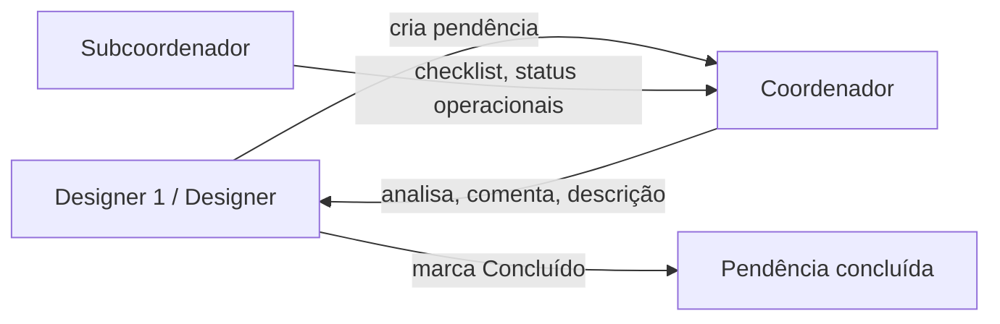

# Tipos de usuário e permissões

## Visão geral

O sistema define **quatro papéis** numerados para matrizes de permissão. Cada usuário autenticado possui exatamente um papel principal. O papel **Coordenador** pode ter um subtipo **autorizado** (terceiro nível de permissão dentro do coordenador) para ações de calendário e cadastro administrativo de pendências.

**Estado no código:** papéis e RBAC **não estão implementados**. NextAuth existe de forma opcional (`src/server/auth/auth-options.ts`) mas as APIs de pendência usam `publicProcedure` sem checagem de sessão.

---

## Papéis

| Código | Identificador sugerido | Nome | Descrição |
|--------|------------------------|------|-----------|
| **1** | `designer_senior` | Designer 1 | Designer sênior/líder. Maior poder de criação, datas, prioridade, checklist, conclusão e cancelamento. |
| **2** | `designer` | Designer | Designer operacional. Executa pendências, preenche contexto e pode marcar **Concluído**. |
| **3** | `coordenador` | Coordenador | Analisa pendências dos designers; edita descrição; define prioridade; pode cancelar. |
| **3a** | `coordenador_autorizado` | Coordenador autorizado | Subtipo do coordenador: pode registrar pendências/metas no calendário (datas início/fim). |
| **4** | `subcoordenador` | Subcoordenador | Papel operacional: checklist e status intermediários; **sem** criar metas, **sem** definir prioridade. |

### Diferenças práticas (definidas)

- **Designer 1 vs Designer:** hierarquia sênior vs operacional — Designer 1 tem mais permissões de estruturação (datas, checklist, prioridade, cancelamento).
- **Subcoordenador:** executa checklist e move status operacionais (Em análise, Corrigido, Em execução em metas), mas não cria metas no calendário nem altera prioridade de pendências.

---

## Fluxo de trabalho entre papéis



### Regras de alto nível

1. **Designers** (1 e 2) **criam** pendências para os **coordenadores** analisarem.
2. **Coordenadores** **analisam** pendências e atualizam status permitidos, comentários ou descrição — **não** marcam status **Concluído**.
3. **Subcoordenadores** apoiam a execução (checklist, status Em análise / Corrigido).
4. **Coordenadores autorizados** registram itens no **calendário** (metas com datas).
5. **Designer 1**, **Designer** e **Coordenador autorizado** podem **editar e excluir** pendências.
6. **Coordenadores** (tipo 3 em geral) **não** podem atribuir status **Concluído** — apenas Designers 1 e 2.

---

## Matriz de permissões — Pendências

Legenda: **1** = Designer 1 · **2** = Designer · **3** = Coordenador · **4** = Subcoordenador

### Campos e ações

| Ação / campo | 1 | 2 | 3 | 4 |
|--------------|:---:|:---:|:---:|:---:|
| Editar pendência (geral) | ✓ | ✓ | ✓ | — |
| Estabelecer datas (início / limite) | ✓ | | ✓ | |
| Editar descrição | ✓ | ✓ | ✓ | |
| Adicionar anexos | ✓ | ✓ | ✓ | |
| Adicionar links | ✓ | ✓ | ✓ | |
| Adicionar checklist (itens novos) | ✓ | | ✓ | |
| Editar checklist (marcar/desmarcar) | ✓ | ✓ | ✓ | ✓ |
| Tags de prioridade (criar/editar) | ✓ | | ✓ | |
| Tags de projeto | ✓ | ✓ | ✓ | |
| Nome do responsável mais próximo | ✓ | ✓ | ✓ | |
| Excluir pendência | ✓ | ✓ | 3a* | |

\* Exclusão: Designer 1, Designer e **Coordenador autorizado** (regra de negócio #9).

### Status da pendência — quem pode definir

| Status | 1 | 2 | 3 | 4 |
|--------|:---:|:---:|:---:|:---:|
| Pendente | ✓ | ✓ | ✓ | |
| Em análise | ✓ | ✓ | ✓ | ✓ |
| Corrigido | ✓ | ✓ | ✓ | ✓ |
| Concluído | ✓ | ✓ | | |
| Cancelado | ✓ | | ✓ | |

**Nota:** Coordenador (3) **não** pode marcar **Concluído**. Designers 1 e 2 são os únicos que encerram o ciclo com sucesso.

### Implementação sugerida (servidor)

```typescript
// Exemplo conceitual — não existe no código ainda
type UserRole = "designer_senior" | "designer" | "coordenador" | "subcoordenador";
type PendencyAction =
  | "set_dates"
  | "edit_description"
  | "set_priority"
  | "set_status_completed"
  | /* ... */;

function can(user: SessionUser, action: PendencyAction): boolean;
```

Validar em cada procedure tRPC (`create`, `update`, `delete`, `reorder`) antes de persistir.

---

## Matriz de permissões — Metas no calendário

Ver detalhes em [calendar-goals.md](./calendar-goals.md).

| Ação | 1 | 2 | 3 | 4 |
|------|:---:|:---:|:---:|:---:|
| Adicionar meta | ✓ | | ✓ | |
| Visualizar meta | ✓ | ✓ | ✓ | ✓ |
| Editar meta | ✓ | | ✓ | |
| Marcar meta como concluída | ✓ | | ✓ | |

### Status de meta — quem pode definir

| Status da meta | 1 | 2 | 3 | 4 |
|----------------|:---:|:---:|:---:|:---:|
| Pendente | ✓ | | ✓ | |
| Em execução | ✓ | ✓ | ✓ | ✓ |
| Concluído | ✓ | | ✓ | |
| Adiado | ✓ | | ✓ | |
| Cancelado | ✓ | | ✓ | |

---

## Visões de UI por papel (alvo)

| Papel | Tela inicial (`/`) — comportamento esperado |
|-------|---------------------------------------------|
| Designer 1 | Acesso completo a criação, datas, prioridade, checklist, conclusão e cancelamento |
| Designer | Criação e edição operacional; pode concluir; sem cancelar nem definir prioridade sozinho (salvo regras futuras) |
| Coordenador | Foco em análise: fila Em análise, comentários, descrição, cancelamento; sem concluir |
| Subcoordenador | Checklist e cards em Em análise / Corrigido; leitura de metas no calendário |
| Coordenador autorizado | Tudo do Coordenador + calendário (criar/editar metas e datas de pendências vinculadas) |

---

## Requisitos funcionais

### RF-U01 — Cadastro de usuário com papel
Todo usuário autenticado possui `role` e, se coordenador, flag `isAuthorizedCoordinator` (nome a definir no schema).

### RF-U02 — Enforcement no servidor
Toda ação negada retorna erro 403 com mensagem clara; UI não exibe controles desabilitados sem feedback.

### RF-U03 — Sessão obrigatória
Em produção, rotas de mutação exigem sessão válida.

### RF-U04 — Herança coordenador autorizado
Coordenador autorizado é coordenador com permissões extras de calendário e exclusão de pendência — não um quinto papel separado na UI de login.

---

## Requisitos não funcionais

### RNF-U01 — Princípio do menor privilégio
Papéis recebem apenas permissões da matriz; novas ações exigem atualização explícita deste documento.

### RNF-U02 — Auditabilidade
Mudanças de papel (admin futuro) devem entrar no histórico global.

---

## Lacunas no código

| Item | Status |
|------|--------|
| Modelo `User` com `role` | Não existe |
| Flag coordenador autorizado | Não existe |
| `protectedProcedure` | Não usado em pendências |
| UI condicional por papel | Não existe |
| Middleware de rota | Não existe |

---

## Perguntas em aberto

1. Coordenador **não autorizado** pode excluir pendência ou só o autorizado?
2. Designer 2 pode cancelar pendência em algum cenário?
3. Um usuário pode ter mais de um papel (ex.: Designer 1 + Coordenador)?
4. Quem administra a flag "coordenador autorizado"?
5. Subcoordenador vê pendências de outras subáreas?
